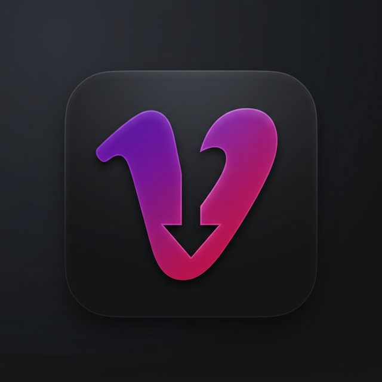

<p align="center">
  
</p>

# <p align="center">🎬 Vimeo Downloader Pro</p>

Una aplicación de escritorio profesional, rápida y elegante para descargar tus videos favoritos de Vimeo en la mejor calidad disponible. Olvídate de extensiones complicadas o sitios web llenos de publicidad; **Vimeo Downloader Pro** es una solución todo-en-uno con una interfaz de "cristal" (glassmorphism) diseñada para la mejor experiencia de usuario.

---

## ✨ Características Principales

-   🚀 **Interfaz de Vanguardia:** Diseño moderno con efectos de desenfoque de cristal, degradados vibrantes y micro-animaciones.
-   🎥 **Selección de Calidad:** Detecta automáticamente las resoluciones disponibles (4K, 1080p, 720p, etc.) y te permite elegir antes de descargar.
-   🎵 **Extractor de Audio:** Opción para descargar solo el audio en formato MP3 de alta calidad.
-   ⚡ **Motor Potente:** Basado en `yt-dlp` y `ffmpeg` para garantizar la máxima velocidad y compatibilidad.
-   🔄 **Sistema de Actualización:** Notificación automática de nuevas versiones directamente desde GitHub.
-   🖥️ **Optimización de Pantalla:** Se abre maximizado por defecto para mayor comodidad.
-   💻 **Multi-formato:** Soporta enlaces con contraseña y una amplia variedad de formatos de Vimeo.

---

## 🛠️ Requisitos Previos

Antes de empezar, asegúrate de tener instalado:

-   [Node.js](https://nodejs.org/) (Versión 16 o superior recomendada)
-   [Git](https://git-scm.com/) (Para clonar el repositorio)

---

## 🚀 Instalación y Uso (Desarrollo)

Si quieres ejecutar el programa desde el código fuente, sigue estos pasos:

1.  **Clonar el repositorio:**
    ```bash
    git clone https://github.com/davidrfyt/VimeoDownload.git
    cd VimeoDownload
    ```

2.  **Instalar dependencias:**
    ```bash
    npm install
    ```

3.  **Iniciar la aplicación:**
    ```bash
    npm start
    ```

---

## 📦 Cómo Compilar (Montaje)

Si quieres generar tu propio archivo ejecutable (`.exe`) para enviárselo a tus amigos:

1.  **Compilar el paquete:**
    ```bash
    npm run dist
    ```
    *Este comando creará una carpeta `dist/` con la versión portable de la aplicación.*

2.  **Distribución:**
    Dentro de la carpeta `dist/` encontrarás el archivo `.zip` listo para ser compartido.

---

## 🏗️ Estructura del Proyecto

-   `main.js`: Lógica principal de Electron (ventana, menús y actualizaciones).
-   `server.js`: El corazón técnico; gestiona las peticiones a Vimeo y las descargas.
-   `public/`: Todo el código del frontend (HTML, CSS y JS).
-   `yt-dlp.exe` / `ffmpeg.exe`: Binarios esenciales para el procesado de video.

---

## 🤝 Créditos y Soporte

Desarrollado con ❤️ por **ShiroChi**.

🌐 **Sitio Web:** [neogalaxyx.com](https://neogalaxyx.com/)

---

### 📝 Notas de Versión actual (v1.3.1)
-   Eliminada la barra de menús clásica para un look más "Cleaner".
-   Añadido selector de resolución inteligente.
-   Integrado el nuevo icono oficial "Ultra Pro".

---
*Este proyecto fue creado para uso personal y educativo. Respeta siempre los derechos de autor de los contenidos que descargues.*
